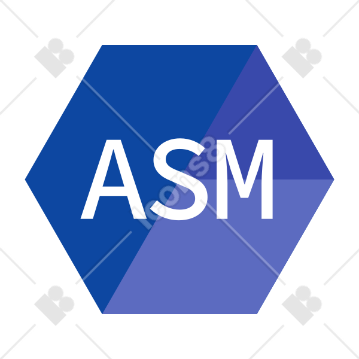

  

  

  
 I am a third-period Computer Science Student at UFPR (Federal University of Paraná). Besides, I appreciate learning languages and new ways to improve my current skills. I’m actively seeking a technology field that captivates me and provides a fulfilling career. My goal is to contribute to innovation and technological advances in the tech industry.

## 
 
### 🚧 Website Under Construction 🚧
My website is currently under construction. Please check back soon for updates!

##

### 🕹️Skills:

#### 🖱️ Programming languages:
  

    
    
    
  

#### ⚒️ Tools:
  

    
    
  

#### 👨‍💻 Others:
  

    
    
  

  
#### 👅 Languages:
  

    
 PT-BR (Native) |   EN (Advanced) |  DT (Beginner)

  

##

  
### 🏆GitHub Stats

  

  
  
  

<picture>
  <source media="(prefers-color-scheme: dark)" srcset="https://raw.githubusercontent.com/Nathaendo/Nathaendo/output/github-contribution-grid-snake-dark.svg">
  <source media="(prefers-color-scheme: light)" srcset="https://raw.githubusercontent.com/Nathaendo/Nathaendo/output/github-contribution-grid-snake.svg">
  
</picture>

  
### 

